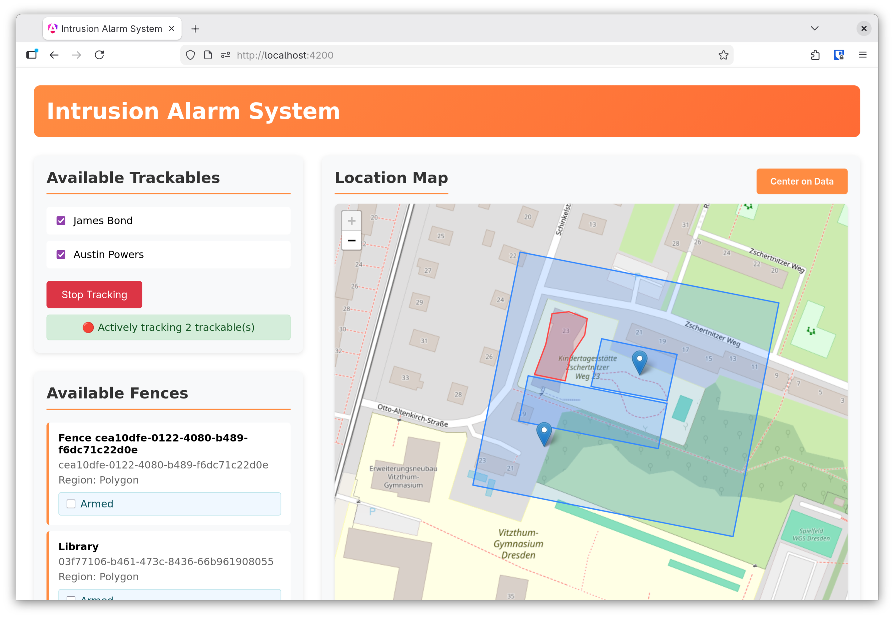
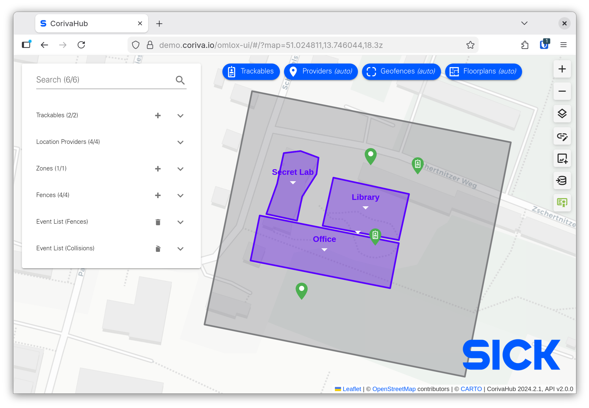
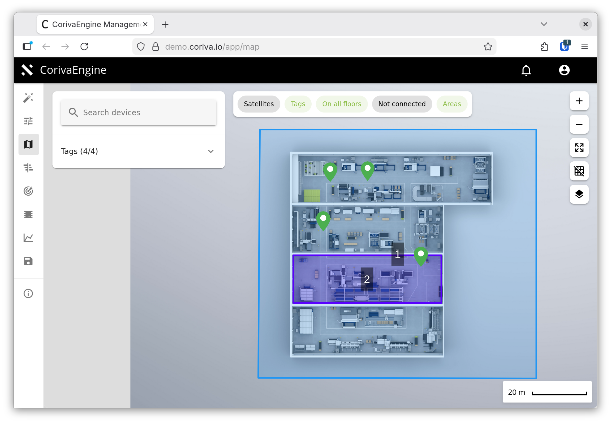

# omlox-demo-typescript

A simple demo app using the [OMLOX Hub API](https://omlox.com/omlox-explained/omlox-hub-and-api) written in Typescript using Angular.

For simplicity we only use the [REST API of the OMLOX Hub](https://omlox.com/omlox-explained/omlox-hub-and-api/omlox-api) even though there is also a WebSocket API which might be better suited for real-time use-cases.

> [!NOTE]
> This demo has been quickly implemented to test out the OMLOX Hub API client that can be found here: https://www.npmjs.com/package/@kodira/omlox-client-typescript-angular
> 
> It is by no means a complete or production ready implementation. Just a quick test that might show others how to make use of the OMLOX Hub API.

## About this Demo App

This is a simple "Intrusion Alarm System". Imagine you are Dr. Evil currently visiting granny. While away from home you really want to know whenever a secret agent is sneaking into your lab. So you track them and once they enter your lab, an alarm will go off. Easy!



The app uses...

- OAuth to get an access token
- BearerAuth to authenticate the API requests using that access token
- the OMLOX Hub API to get `Trackables` and `Fences` and to figure out whether or not a `Trackable` is inside a `Fence`.

## Running the Demo App

There are multiple vendors offering OMLOX Hub implementations. Since we only had access to a demo instance of [Coriva](https://zigpos.com/de/service/) provided by [Zigpos](https://zigpos.com), we will refer to that system only from here on.

### Prerequisites

In order to run the demo app you need

- the base URL of the OMLOX Hub API that you are using. Preconfigured is `https://demo.coriva.io/corivahub/v2`. See `app/proxy.conf.json` if you need to change it.
- the base URL of the OAuth identity provider (IdP) that you are using. Preconfigured is `https://demo.coriva.io/idp/realms/rtls/protocol/openid-connect`. See `app/proxy.conf.json` if you need to change it.
- the OAuth `client_id` and `client_secret`. Put them into `app/src/environments/environment*.ts`

Then run `npm install` to install the dependencies and `npm start` to start the app.

## Implementation note about CORS

The demo instance of the Coriva OMLOX Hub API does not (yet?) support CORS. Therefore sending API requests from the browser using a `localhost` origin fails with the following error

```
Cross-Origin Request Blocked: The Same Origin Policy disallows reading the remote resource at https://demo.coriva.io/idp/realms/rtls/protocol/openid-connect/token. (Reason: CORS header 'Access-Control-Allow-Origin' missing). Status code: 200
```

To circumvent this, we are using the local Angular development proxy to trick the browser into thinking that those requests are local to the app. See `app/proxy.conf.json` for details.

## General information and links regarding OMLOX

It is important to understand that the OMLOX Hub and the OMLOX Engine are two different things. The OMLOX Engine collects location data on site and sends this to the OMLOX Hub. The OMLOX Hub can get data from various sources and provides a unified interface for clients to get that location data. That interface is the OMLOX Hub API.

Our demo app will connect to the **Hub** not the **Engine**.


### Coriva specific links and documentation

You can find the documentation here:
https://portal.coriva.io/coriva-docs/user_manual/2025.1

> [!NOTE]
> You'll need to create an account to access the documentation.

#### Coriva Engine UI
- User interface: https://demo.coriva.io/app/map
- Default users and passwords can be found [here](https://portal.coriva.io/coriva-docs/user_manual/2025.1/user-accounts.html#_default_user_accounts).



#### Coriva Hub UI
- User interface: https://demo.coriva.io/omlox-ui/
- Username and password are the same as used on `portal.coriva.io`




#### OAuth Credential to access the Hub API
- baseUrl: `https://demo.coriva.io/idp/realms/rtls/protocol/openid-connect`
- clientId and clientSecret can be found [here](https://portal.coriva.io/coriva-docs/user_manual/2025.1/developer-guide/api-authorization.html).

#### Hub API access
- baseUrl: `https://demo.coriva.io/corivahub/v2`
- spec: `https://omlox.com/fileadmin/api/omlox_Hub_API_2.0.0.json`
